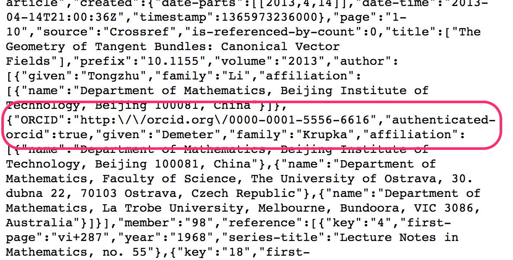

##Other methods for getting authenticated iDs

You have just followed a method a custom integration would use to get ORCIDs from users. The following are other methods for getting authenticated iDs from ORCID users.

##Servive Provider systems

Some publishing, research information and repository software systems support collecting authenticated iDs and permissions right out of the box. See our list of [ORCID-enabled systems](https://members.orcid.org/api/orcid-enabled-systems) for more details.

Configuration steps and customization options vary widely between systems - check your system's documentation for complete information.

<!--- This should actually be institutional connect but let's remove for now since only one member has put it in place.
##Institutional sign-in

You can enable access using institutional credentials. Check out the [Members Documentation](http://members.orcid.org/api/integrate/institution-sign-in) for more information.
--->

<!--- Product is looking at whether to still support this. Removed for now (as of 2020-11-02)
##Share my iD

Need a quick way to collect authenticated iDs with no programming or IT resources needed?
[Share my iD](https://share-my-id.orcid.org/) is a new app from ORCID that allows anyone with an ORCID iD to get iDs from other ORCID users.<br>
  
--->

##DOI metadata

Many systems now collect ORCID iDs and publish them in DOI (and other persistent identifier) metadata. If you have a DOI for a publication, dataset, or other digital object, you can check its metadata for author ORCID iDs. However, note ORCID cannot guarantee that the iDs for the listed authors have been authenticated.

###Example: CrossRef API
For example, using the [CrossRef REST API](https://github.com/CrossRef/rest-api-doc/blob/master/rest_api.md), we can find an author's ORCID iD in the DOI metadata for ```http://dx.doi.org/10.1155/2013/364301```

1. In a new window or tab, visit ```https://api.crossref.org/v1/works/10.1155/2013/364301```
2. In the JSON data that appears, ORCID iDs submitted by the publisher in the DOI metadata are included in the ```author``` element.
<br>
  
