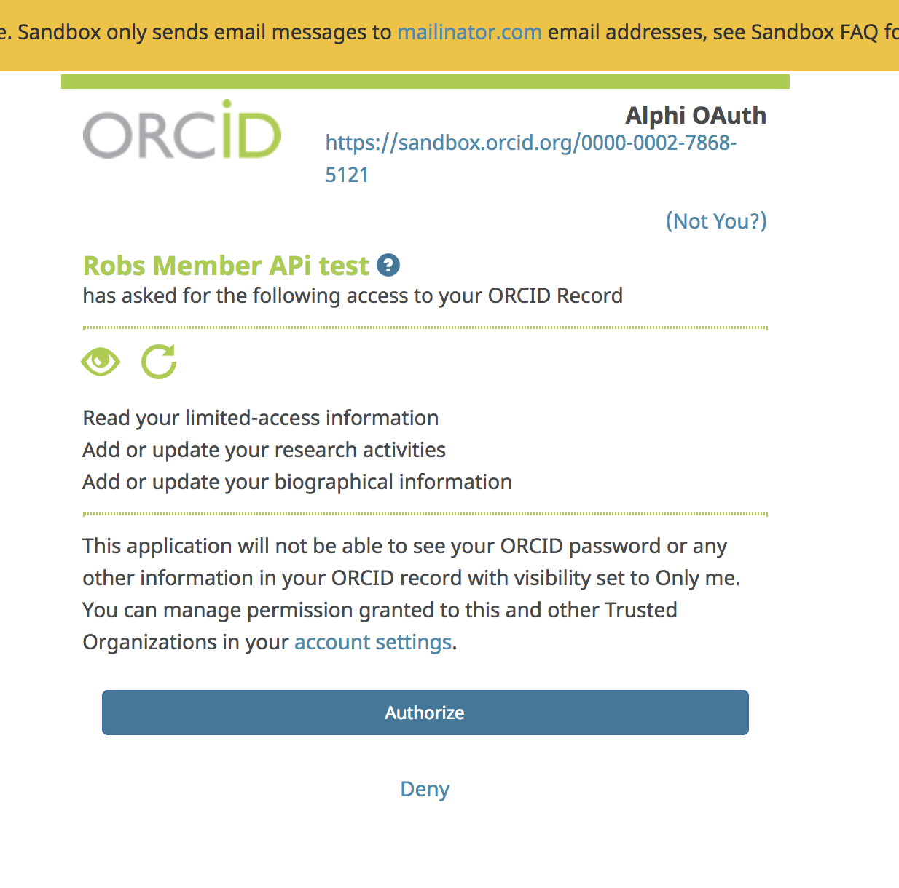
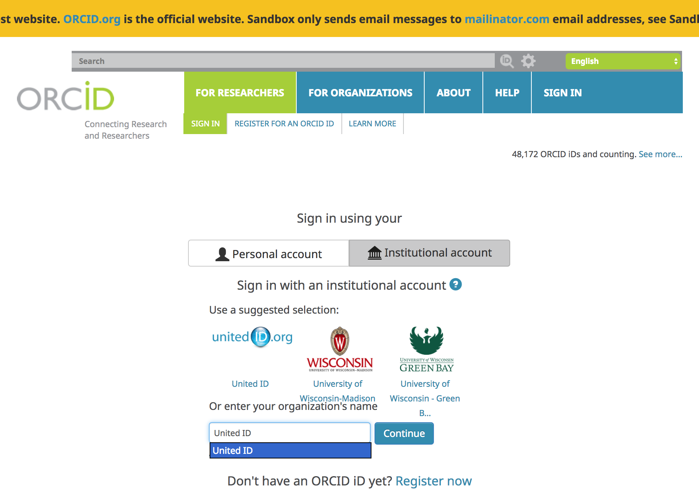
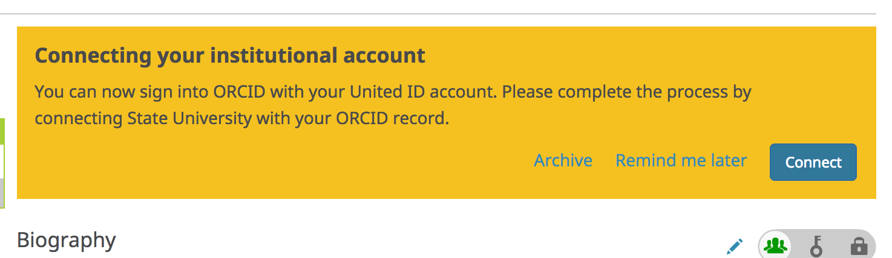

In our first few API requests, we already knew which ORCID iD to use (our own!) and we read/searched public information, which didn't require any permission from the user. In practice, you'll need to gather up iDs for researchers whose ORCID records you want to read, update, or associate with records in your own system AND get permission to take certain actions, like adding information to their ORCID records. In this section, we'll look at a few ways to get authenticated iDs and/or record access permission.

**Authenticated iDs**

ORCID is about disambiguation,it's important that you get the correct iD for each researcher. The best way to do this is to collect **Authenticated ORCID iDs**, which means that each researcher signs into their ORCID account and authorizes your system to obtain their iD. [Learn more about Authenticated iDs](https://orcid.org/blog/2017/02/20/whats-so-special-about-signing)

**Record access permission**

Control over access to data in your ORCID record is one of [ORCID's core princples](https://orcid.org/about/what-is-orcid/principles). While you can read public ORCID data without the record owner's involvement, some API actions require permission:

* Get an Authenticated ORCID iD
* Read non-public data (items with privacy set to 'Trusted parties')
* Add/update record data

##Custom integration

The most customizable way to get Authenticated iDs is by building your own API integration. In this section, we'll walk through the steps that your own custom integratio would need to complete in order to get an authenticated iD and record access permission.

**OAuth 2.0**

Getting an Authenticated iD and record access permission from a user involves following [OAuth 2.0](https://oauth.net/2/), an industry-standard protocol for authorization. OAuth allows a user to give a website or application access to account information stored on another site, without giving that site their password.

If you've ever signed into a site using Google or Facebook instead of your credentials for that particular site, you've already used OAuth!

**The OAuth process includes 3 steps:**

1. Create an authorization URL
1. Get an authorization code
2. Exchange the authorization code for an access token

###Get API credentials
API credentials consisting of a **client ID** and a **client secret** are needed in order to get Authenticated iDs and/or user permissions.

To get Authenticated iDs, you can use Public or Member API credentials. To get permission to read non-public information or add/update researchers' ORCID records, you'll need Member API credentials. To request API credentials, see [Request API credentials](https://orcid.org/content/register-client-application)

For this workshop, we'll use a set of demo credentials:

```
client_id: APP-XA6KUTFCVQL0622C
client_secret: 7c8d6b1b-401b-4f5d-9b8b-b8108c6e197c
```
(Demo client secret created for this workshop - do not share API client secrets!)


###Create an authorization URL
To kick off the OAuth process, we'll need to create an special authorization URL that sends users to an ORCID sign-in screen. This URL consists of **Authorization endpoint**, plus **Parameters** that identify your organization and the permissions you want to request.

**Authorization endpoint (Sandbox)**

```https://sandbox.orcid.org/oauth/authorize```


**Parameters**

| Parameter | Description | Example |
| ----------| ----------- | ------- |
|**client_id**| Your Member or Public API client ID (issued by ORCID)<br>To request API credentials, see [Request API credentials](https://orcid.org/content/register-client-application) | ```APP-XA6KUTFCVQL0622C``` |
|**response_type**|  | ```code``` |
|**scope**| API action(s) you want to request permission for, from the list of [ORCID Scopes](https://members.orcid.org/api/oauth/orcid-scopes). | ```/authorize``` <br> ```/activities/update```
|**redirect_uri**| Page on your site that users will see after they complete the authorization process (must be on the list of allowed redirect URIs you specified when requesting your API credentials)  | ```https://developers.google.com/oauthplayground``` |

To request permission to add/update activities (affiliations, funding, works, peer review items) using a demo client ID created for this workshop, our authorization URL will be:

```
https://sandbox.orcid.org/oauth/authorize?client_id=APP-XA6KUTFCVQL0622C&response_type=code&scope=/activities/update&redirect_uri=https://developers.google.com/oauthplayground
```

###Get an authorization Code

1. In a new window or tab, visit<br>
[https://sandbox.orcid.org/oauth/authorize?client_id=APP-XA6KUTFCVQL0622C&response_type=code&scope=/activities/update&redirect_uri=https://developers.google.com/oauthplayground](https://sandbox.orcid.org/oauth/authorize?client_id=APP-XA6KUTFCVQL0622C&response_type=code&scope=/activities/update&redirect_uri=https://developers.google.com/oauthplayground)

2. An ORCID sign-in screen listing the requested permissions will appear; sign into your Sandbox account and click **Authorize**<br>

3. After granting permission, you'll be redirected to the Google OAuth Playground. A 6-character code will appear at the end of the redirect URI in the browser address bar (and under the **Step 2** section at left)<br>
<br><br>


###Exchange authorization code for access token & authenticated iD
Once you have an  Authorization Code, you can exchange it for an Access Token and the Authenticated iD of the user who signed in, which you'll need in order to take the API action(s) you requested permission for.

In a real-world situation, this exchange would be done by your system, using a programming language such as  PHP, Java, or Ruby on Rails. For this workshop, we'll use Google OAuth Playground to simulate a web application.

1. Click the gear icon in the upper right corner to open the **OAuth 2.0 Configuration**<br>

2. Enter the following settings and click **Close**

| Field | Value |
| ------| ------|
|**OAuth flow**| Server-side |
|**OAuth endpoints**| Custom |
|**Authorization endpoint**| ```https://sandbox.orcid.org/oauth/authorize``` |
|**Token endpoint**| ```https://sandbox.orcid.org/oauth/token``` |
|**Access token location**| Authorization header w/Bearer prefix |
|**OAuth Client ID**| ```APP-XA6KUTFCVQL0622C```<br>(Demo client ID created for this workshop) |
|**OAuth Client Secret**| ```7c8d6b1b-401b-4f5d-9b8b-b8108c6e197c```<br>(Demo client secret created for this workshop - do not share API client secrets!) |

3. In the **Step 2 Exchange authorization code for tokens** section at left, click **Exchange authorization code for tokens**<br>

4. Your Access Token and Authenticated iD will appear **Request/Response** section at right.<br>


##Vendor systems

Some publishing, research information and repository software systems support collecting authenticated iDs and permissions right out of the box. See our list of [ORCID-enabled systems](https://members.orcid.org/api/orcid-enabled-systems) for more details.

Configuration steps and customization options vary widely between systems - check your system's documentation for complete information.

##Institutional sign-in

ORCID recently added the option to sign in using institutional credentials. Institutional sign-in is available to researchers affiliated with members of supported identity federations, currently [SURFconext](https://www.surf.nl/en/services-and-products/surfconext/index.html) and [eduGAIN](https://technical.edugain.org/status.php).

ORCID membership is not required in order for institutional sign-in to work for your researchers, however, ORCID members who are [SURFconext](https://www.surf.nl/en/services-and-products/surfconext/index.html) or [eduGAIN](https://technical.edugain.org/status.php) federation members can automatically request ORCID iDs and ORCID record access permission from users who sign into ORCID with their institutional credentials using the new Institutional Collect & Connect feature.

In this section, we'll take a look at this feature. [Learn more about ORCID institutional signin, including configuring up your IdP](https://members.orcid.org/api/integrate/institution-sign-in)

###Configure API credentials
In addition to getting Member API credentials as described above, ORCID will need a few more pieces of information to set up Institutional Collect & Connect for your organization.

To have your API credentials configured for Institutional Collect & Connect, contact [support@orcid.org](support@orcid.org) with the following information:

* Client ID
* Identity provider entity ID (e.g. https://idp.example.org/idp/shibboleth)
* Redirect URI: The page on your site that users should be directed to after they complete the cross-link process. This can bedifferent from the redirect URI you use for other ORCID API applications.
* Permission scope(s) that you would like (```/authenticate```, ```/read-limited```, ```/activities/update```, ```/person/update```)

###(User) Connect your institutional account

**Not a member of a supported federation?** Test out ORCID institutional sign-in with a [United ID](https://app.unitedid.org/signup) account. United ID is a free and independent online identity service *(Note: United ID requires use of a 2-Factor Authentication method, like [Google Authenticator](https://support.google.com/accounts/answer/1066447?hl=en))*.

  1. Sign out of your Sandbox record - click the **Sign out** button in the upper right corner or visit [https://sandbox.orcid.org/signout](https://sandbox.orcid.org/signout)
  2. Visit [https://sandbox.orcid.org/signin](https://sandbox.orcid.org/signin) and click **Sign in using your Institutional Account**
  3. Enter your organization's name in the box, or choose to pick it from the list.
  
  4. Sign into your institution account<br>
  
  5. Finish linking your accounts by signing into ORCID with your ORCID username and password. Enter the email address / ORCID iD and password for your Sandbox account and click **Sign into ORCID**. *You will only need to complete this step once - in the future you can log directly into ORCID with your institutional account.*<br>
  
  6. After linking your accounts, a message appears at the top of your ORCID record, prompting you to connect your iD to your institution. Click the **Connect** button.<br>
  
  7. An ORCID sign-in screen listing the requested permissions will appear; click **Authorize**<br>
  
  8. After granting permission, you'll be redirected to the Redirect URI specified for your API credentials - this page should show a success or error message depending on whether **Authorize** or **Deny** was clicked, and it should also provide a link back to ORCID and links to your local ORCID resources.<br>
  

###Exchange authorization code for access token & authenticated iD
Like in section 4.1.4 above, an authorization code is attached to the end of the redirect URI, which can be exchanged for an access token and the user's ORCID iD.<br>
  

##Share my iD

Need a quick way to collect authenticated iDs with no programming or IT resources needed?
[Share my iD](https://share-my-id.orcid.org/) is a new app from ORCID that allows anyone with an ORCID iD to get iDs from other ORCID users.<br>
  

##DOI metadata

Many systems now collect authenticated ORCID iDs and publish them in DOI (and other persistent identifier) metadata. If you have a DOI for a publication, dataset, or other digital object, you can check its metadata for author ORCID iDs.

###Example: CrossRef API
For example, using the [CrossRef REST API](https://github.com/CrossRef/rest-api-doc/blob/master/rest_api.md), we can find an author's ORCID iD in the DOI metadata for ```http://dx.doi.org/10.1155/2013/364301```

1. In a new window or tab, visit ```https://api.crossref.org/v1/works/10.1155/2013/364301```
2. In the JSON data that appears, ORCID iDs submitted by the publisher in the DOI metadata are included in the ```author``` element.
<br>
  
