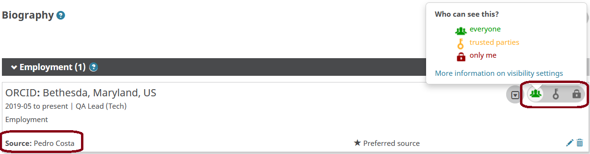
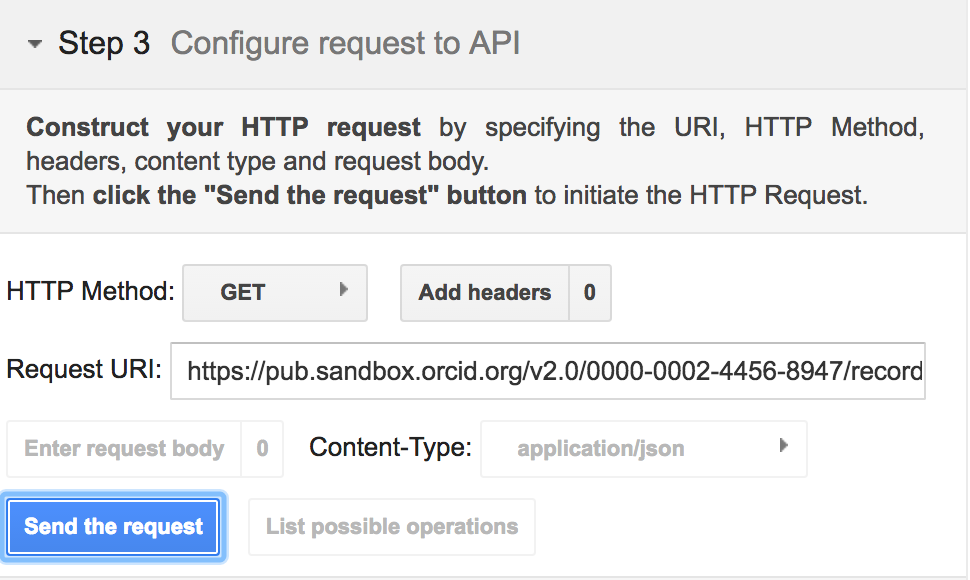
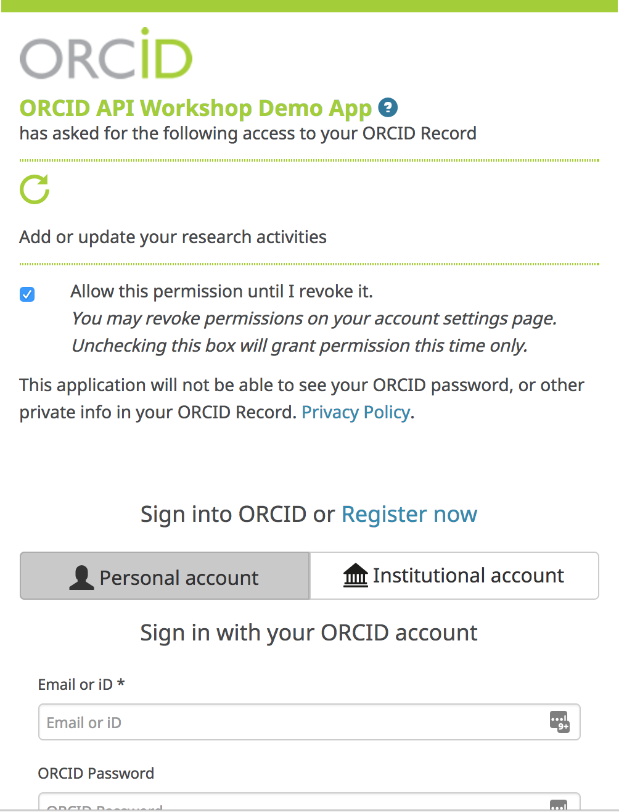
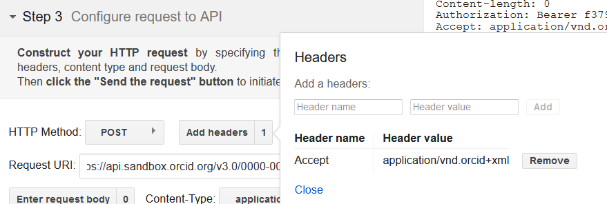
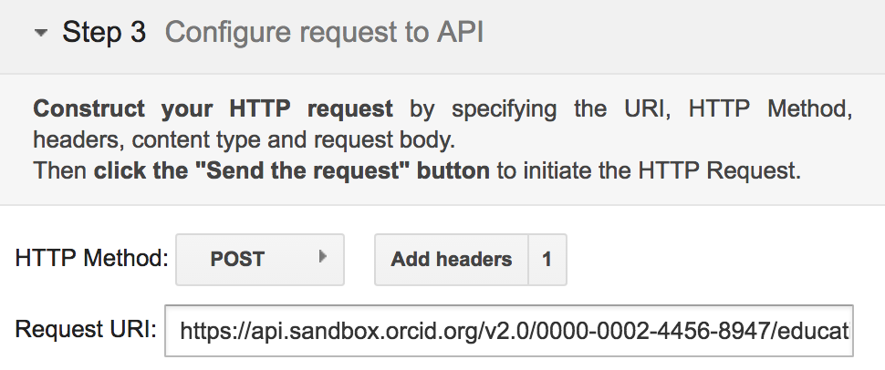
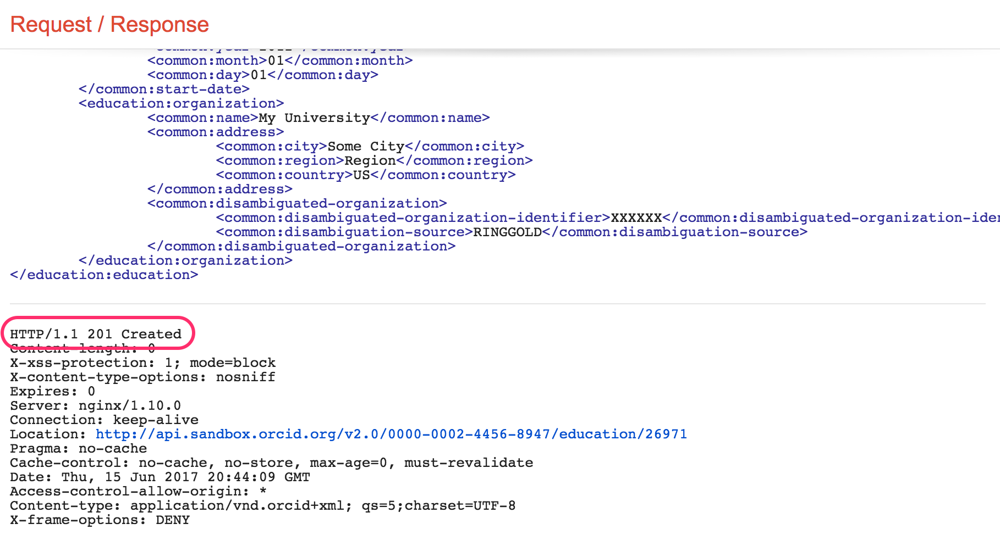
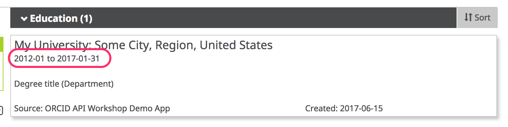

#0. WELCOME
##0.1 About the ORCID APIs
ORCID's web interface gives researchers a way to interact with their record, but the real power of ORCID lies in the underlying data, which can be accessed by people and systems via Application Programming Interfaces (APIs).

| API&nbsp;Version   | Access | Features |
| -------------- | ------ | --- |
**Public&nbsp;API** | Freely available to anyone | **Authenticate:** Obtain a user&rsquo;s authenticated ORCID iD<br> **Read (Public):** Search/retrieve public data<br> **Create:** Create new ORCID records on demand
**Member&nbsp;API** | Available to organizations that support ORCID with an annual membership subscription<br>*(Sandbox Member API freely available to all for testing)* | All Public API features, plus:<br> **Read (Limited):** Search/retrieve public data<br> **Update:** Post new items to a record (affiliations, works, etc.) or edit items that you added previously

All of the ORCID APIs are  based on the same set of technologies:

* **REST:** ORCID APIs are &ldquo;RESTful&rdquo;, which  means that they use HTTP (hyper-text transfer) calls to transfer information.
* **OAuth:** ORCID  APIs use the OAuth 2.0 authentication protocol in order to grant client  applications access to users&rsquo; ORCID records.
* **XML/JSON:** ORCID APIs support data exchange in either XML or JSON format.

##0.2 Pre-requisites
To complete this tutorial, you'll need the following tools:

* **Web browser:** Firefox (33+), Chrome (38+), Internet Explorer (10+), Safari (6+)
* **Internet connection**
* **Plain text editor:** TextEdit (Mac), Notepad++ (Win), or your preferred plain text editor
* **Software capable of making HTTP requests:**
    - cURL: Free, command-line application available for Mac  or Windows at <a href="http://curl.haxx.se/download.html">http://curl.haxx.se/download.html</a> (pre-installed on most Mac OS versions; accessible within Terminal application)
    - Online tools, like [Google OAuth Playground](https://developers.google.com/oauthplayground/) or [hurl.it](http://hurl.it">hurl.it)

Examples in this doc use [Google OAuth Playground](https://developers.google.com/oauthplayground/)

#1. SET UP THE SANDBOX
For this workshop, we'll use ORCID's test environment, the [ORCID Sandbox](https://sandbox.orcid.org/signin). The Sandbox works just like the production ORCID Registry, with a few exceptions:

* Sandbox only sends emails to [mailinator.com](https://www.mailinator.com/) addresses 
* Import wizard tools don't work in the Sandbox
* Menu links to informational content (For Researchers, For Organizations, About, Help, etc) don't work in the Sandbox
* Sandbox doesn't contain production data

##1.1 Create a Sandbox ORCID record
To get started, you'll need to register an ORCID iD in the Sandbox.

1. In a new window or tab, visit <a href="https://sandbox.orcid.org/signin" target="_blank">https://sandbox.orcid.org/register</a>
3. Complete the form with a name, email, and password.<br>
_**IMPORTANT!** Don&rsquo;t use a real email address! Instead, make up an address  ending in @mailinator.com (ex: sgarcia@mailinator.com)._<br>

4. Click the **I consent…** checkbox and click **Register**.<br>
*Remember the email and password - you'll need these throughout the rest of the tutorial!*

##1.2 Verify your email address
Before you can edit information on your ORCID record, you'll need to verify your email address.

1. In a new window or tab, visit [https://www.mailinator.com](https://www.mailinator.com/)
2. Enter the @mailinator.com address you used to register your Sandbox account and click **Go**.<br>

3. Open the message with the subject **[ORCID] Reminder to verify your email address** and click the **Verify your email address** button.<br>

4. Log into ORCID, if prompted, to finish verifying your email. Since you've just registered, you are likely already logged in and will not be prompted to log in again.
5. After verifying your email, you'll be redirected to your Sandbox record<br>
*Make note of the 16-digit iD for your Sandbox record - you'll need this throughout the rest of the tutorial!*<br>


##1.3 Add info to your Sandbox record
1. **Add a country:** Click the pencil icon beside Country, choose a country and click **Save changes**.<br>

2. **Add employment:** In the **Employment** section, click **Add employment** > **Add manually**, fill out the form and click **Add to list**.<br>

3. Take a look at your employment entry and notice the following fields, which are included with each item on an ORCID record: 
    - **Source:** Person or organization that added the item
    - **Created:** Date the item was added
    - **Privacy:** [Visibility setting](https://support.orcid.org/knowledgebase/articles/124518-orcid-visibility-settings) for the item

  
#2. READ PUBLIC INFO
In this section, we'll use the Public API to take a look at the underlying data for our Sandbox record. 

##2.1 Read a record summary
1. In a new window or tab, visit [https://developers.google.com/oauthplayground](https://developers.google.com/oauthplayground)
2. On the left side of the screen, click **Step 3 Configure request to API**
3. In the **Request URI** field enter:<br>
```https://pub.sandbox.orcid.org/v2.0/[ORCID ID]/record```<br>
*Replace [ORCID ID] with the iD for your Sandbox record, format XXXX-XXXX-XXXX-XXXX*<br>

4. Click **Send the request**
5. A summary version of your record in XML format will appear in the **Request/Response** section<br>


##2.2 Read activity details
To get more information about a specific item on an ORCID record, you can retrieve that individual item using its put-code.

1. In the record summary XML, find the **activities-summary** section, then find the **put-code** for the employment item that you added in the previous section.<br>

3. In the **Request URI** field enter:<br>
```https://pub.sandbox.orcid.org/v2.0/[ORCID ID]/employment/[PUT CODE]```<br>
*Replace [ORCID ID] with the iD for your Sandbox record, format XXXX-XXXX-XXXX-XXXX and [PUT CODE] with the put-code for your employment item*<br>

4. Click **Send the request**
5. Fulls details of your employment entry will appear in the **Request/Response** section<br>


#3. SEARCH PUBLIC INFO
In addition to reading information on a specific ORCID record, you can use the API to search for ORCID records that contain specific information.

In this section, we'll try searches using just a few of the available fields. For a full list of fields that you can search, see our [Basic tutorial: Searching Data using the ORCID API](https://members.orcid.org/api/tutorial/search-orcid-registry)

##3.1 Search for records with an institutional affiliation
1. In a new window or tab, visit [https://developers.google.com/oauthplayground](https://developers.google.com/oauthplayground)
2. On the left side of the screen, click **Step 3 Configure request to API**
3. In the **Request URI** field enter:<br>
```https://pub.sandbox.orcid.org/v2.0/search/?q=affiliation-org-name:%22Boston%20University%22```<br>
*Optional: <br>

4. Click **Send the request**
5. The total number of matching ORCID iDs and a list of those iDs will appear **Request/Response** section<br>


##3.2 Paging through search results
If your search matches more than 100 ORCID iDs, only the first 100 iDs will be returned in the list of results. To get the next set of results, you'll need to make another API request.

1. On the left side of the screen, click **Step 3 Configure request to API**
2. In the **Request URI** field enter:<br>
```https://pub.sandbox.orcid.org/v2.0/search/?q=affiliation-org-name:%22Boston%20University%22&start=101&rows=200```<br>
3. Click **Send the request**
4. The total number of matching ORCID iDs and a list of iDs 101-301 will appear in the **Request/Response** section<br>


To get the entire set of results, repeat the query in step 2, changing ```start=``` until you've reached collected all of your results.


#4. COLLECT: GET AUTHENTICATED iDs & PERMISSION
In our first few API requests, we already knew which ORCID iD to use (our own!) and we read/searched public information, which didn't require any permission from the user. In practice, you'll need to gather up iDs for researchers whose ORCID records you want to read, update, or associate with records in your own system AND get permission to take certain actions, like adding information to their ORCID records.

**Authenticated iDs**

ORCID is all about identifying who's who, so it's important that you get the correct iD for each researcher. The best way to do this is to collect **Authenticated ORCID iDs**, which means that each researcher signs into their ORCID account and authorizes your system to obtain their iD. [Learn more about Authenticated iDs](https://orcid.org/blog/2017/02/20/whats-so-special-about-signing)

**Record access permission**

Control over access to data in your ORCID record is one of [ORCID's core princples](https://orcid.org/about/what-is-orcid/principles). While you can read public ORCID data without the record owner's involvement, some API actions require permission:

* Get an Authenticated ORCID iD
* Read non-public data (items with privacy set to 'Trusted parties')
* Add/update record data


##4.1 Custom integration

The most customizable way to get Authenticated iDs is by building your own API integration. In this section, we'll walk through the steps that your own custom integratio would need to complete in order to get an authenticated iD and record access permission.

**OAuth 2.0** 

Getting an Authenticated iD and record access permission from a user involves following [OAuth 2.0](https://oauth.net/2/), an industry-standard protocol for authorization. OAuth allows a user to give a website or application access to account information stored on another site, without giving that site their password. 

If you've ever signed into a site using Google or Facebook instead of your credentials for that particular site, you've already used OAuth!

**The OAuth process includes 3 steps:**

1. Create an authorization URL
1. Get an authorization code
2. Exchange the authorization code for an access token

###4.1.1 Get API credentials
API credentials consisting of a **client ID** and a **client secret** are needed in order to get Authenticated iDs and/or user permissions.

To get Authenticated iDs, you can use Public or Member API credentials. To get permission to read non-public information or add/update researchers' ORCID records, you'll need Member API credentials. To request API credentials, see [Request API credentials](https://orcid.org/content/register-client-application)

For this workshop, we'll use a set of demo credentials:


###4.1.2 Create an authorization URL
To kick off the OAuth process, we'll need to create an special authorization URL that sends users to an ORCID sign-in screen. This URL consists of **Authorization endpoint**, plus **Parameters** that identify your organization and the permissions you want to request.

**Authorization endpoint (Sandbox)**

```https://sandbox.orcid.org/oauth/authorize```


**Parameters**

| Parameter | Description | Example |
| ----------| ----------- | ------- |
|**client_id**| Your Member or Public API client ID (issued by ORCID)<br>To request API credentials, see [Request API credentials](https://orcid.org/content/register-client-application) | ```APP-XA6KUTFCVQL0622C``` |
|**response_type**|  | ```code``` |
|**scope**| API action(s) you want to request permission for, from the list of [ORCID Scopes](https://members.orcid.org/api/oauth/orcid-scopes). | ```/authorize``` <br> ```/activities/update```
|**redirect_uri**| Page on your site that users will see after they complete the authorization process (must be on the list of allowed redirect URIs you specified when requesting your API credentials)  | ```https://developers.google.com/oauthplayground``` |

To request permission to add/update activities (affiliations, funding, works, peer review items) using a demo client ID created for this workshop, our authorization URL will be:

```
https://sandbox.orcid.org/oauth/authorize?client_id=APP-XA6KUTFCVQL0622C&response_type=code&scope=/activities/update&redirect_uri=https://developers.google.com/oauthplayground
```

###4.1.3 Get an authorization Code

1. In a new window or tab, visit<br>
[https://sandbox.orcid.org/oauth/authorize?client_id=APP-XA6KUTFCVQL0622C&response_type=code&scope=/activities/update&redirect_uri=https://developers.google.com/oauthplayground](https://sandbox.orcid.org/oauth/authorize?client_id=APP-XA6KUTFCVQL0622C&response_type=code&scope=/activities/update&redirect_uri=https://developers.google.com/oauthplayground)

2. An ORCID sign-in screen listing the requested permissions will appear; sign into your Sandbox account and click **Authorize**<br>

3. After granting permission, you'll be redirected to the Google OAuth Playground. A 6-character code will appear at the end of the redirect URI in the browser address bar (and under the **Step 2** section at left)<br>
<br><br>


###4.1.4 Exchange authorization code for access token & authenticated iD
Once you have an  Authorization Code, you can exchange it for an Access Token and the Authenticated iD of the user who signed in, which you'll need in order to take the API action(s) you requested permission for. 

In a real-world situation, this exchange would be done by your system, using a programming language such as  PHP, Java, or Ruby on Rails. For this workshop, we'll use Google OAuth Playground to simulate a web application.

1. Click the gear icon in the upper right corner to open the **OAuth 2.0 Configuration**<br>

2. Enter the following settings and click **Close**

| Field | Value |
| ------| ------|
|**OAuth flow**| Server-side |
|**OAuth endpoints**| Custom |
|**Authorization endpoint**| ```https://sandbox.orcid.org/oauth/authorize``` |
|**Token endpoint**| ```https://sandbox.orcid.org/oauth/token``` |
|**Access token location**| Authorization header w/Bearer prefix |
|**OAuth Client ID**| ```APP-XA6KUTFCVQL0622C```<br>(Demo client ID created for this workshop) |
|**OAuth Client Secret**| ```7c8d6b1b-401b-4f5d-9b8b-b8108c6e197c```<br>(Demo client secret created for this workshop - do not share API client secrets!) |

3. In the **Step 2 Exchange authorization code for tokens** section at left, click **Exchange authorization code for tokens**<br>

4. Your Access Token and Authenticated iD will appear **Request/Response** section at right.<br>


##4.3 Institutional sign-in

ORCID recently added the option to sign in using institutional credentials. Institutional sign-in is available to researchers affiliated with members of supported identity federations, currently [SURFconext](https://www.surf.nl/en/services-and-products/surfconext/index.html) and [eduGAIN](https://technical.edugain.org/status.php).

ORCID membership is not required in order for institutional sign-in to work for your researchers, however, ORCID members who are [SURFconext](https://www.surf.nl/en/services-and-products/surfconext/index.html) or [eduGAIN](https://technical.edugain.org/status.php) federation members can automatically request ORCID iDs and ORCID record access permission from users who sign into ORCID with their institutional credentials using the new Institutional Collect & Connect feature.

In this section, we'll take a look at this feature.

###4.3.1 Configure API credentials
In addition to getting Member API credentials as described above, ORCID will need a few more pieces of information to set up Institutional Collect & Connect for your organization. 

To have your API credentials configured for Institutional Collect & Connect, contact [support@orcid.org](support@orcid.org) with the following information:

* Client ID
* Identity provider entity ID (e.g. https://idp.example.org/idp/shibboleth)
* Redirect URI: The page on your site that users should be directed to after they complete the cross-link process. This can bedifferent from the redirect URI you use for other ORCID API applications.
* Permission scope(s) that you would like (```/authenticate```, ```/read-limited```, ```/activities/update```, ```/person/update```)

###4.3.2 (User) Connect your institutional account

**Not a member of a supported federation?** Test out ORCID institutional sign-in with a [United ID](https://app.unitedid.org/signup) account. United ID is a free and independent online identity service *(Note: United ID requires use of a 2-Factor Authentication method, like [Google Authenticator](https://support.google.com/accounts/answer/1066447?hl=en))*.

  1. Sign out of your Sandbox record - click the **Sign out** button in the upper right corner or visit [https://sandbox.orcid.org/signout](https://sandbox.orcid.org/signout)
  2. Visit [https://sandbox.orcid.org/signin](https://sandbox.orcid.org/signin) and click **Sign in using your Institutional Account**
  3. Enter your organization's name in the box, or choose to pick it from the list. 
  
  4. Sign into your institution account<br>
  
  5. Finish linking your accounts by signing into ORCID with your ORCID username and password. Enter the email address / ORCID iD and password for your Sandbox account and click **Sign into ORCID**. *You will only need to complete this step once - in the future you can log directly into ORCID with your institutional account.*<br>
  
  6. After linking your accounts, a message appears at the top of your ORCID record, prompting you to connect your iD to your institution. Click the **Connect** button.<br>
  
  7. An ORCID sign-in screen listing the requested permissions will appear; click **Authorize**<br>
  
  8. After granting permission, you'll be redirected to the Redirect URI specified for your API credentials - this page should show a success or error message depending on whether **Authorize** or **Deny** was clicked, and it should also provide a link back to ORCID and links to your local ORCID resources.<br>
  

###4.3.3 Exchange authorization code for access token & authenticated iD
Like in section 4.1.4 above, an authorization code is attached to the end of the redirect URI, which can be exchanged for an access token and the user's ORCID iD.<br>
   

##4.3 Vendor systems

Some publishing, research information and repository software systems support collecting authenticated iDs and permissions right out of the box. See our list of [ORCID-enabled systems](https://members.orcid.org/api/orcid-enabled-systems) for more details. 

Configuration steps and customization options vary widely between systems - check your system's documentation for complete information.

##4.4 Share my iD

Need a quick way to collect authenticated iDs with no programming or IT resources needed?
[Share my iD](https://share-my-id.orcid.org/) is a new app from ORCID that allows anyone with an ORCID iD to get iDs from other ORCID users.


##4.3 Other metadata sources
  
#6. CONNECT: ADD INFO

Now that we've got an Access Token, we can use it like a password to take the API actions we requested permission for (in this case, to update Activities). In this section, we'll add an education affiliation to our Sandbox record.

##6.1 Add an affiliation

1. Beneath **Step 3: Configure request to API**, set **HTTP Method** to **POST**.<br>

2. Click **Add headers**, enter the values below, then click **Add** and **Close**
    - **Header name:** ```accept```
    - **Header value:** ```application/vnd.orcid+xml```
<br>

5. In the **Request URI** field enter:<br>
```https://api.sandbox.orcid.org/v2.0/[ORCID ID]/education```<br>
*Replace [ORCID ID] with the iD for your Sandbox record, format XXXX-XXXX-XXXX-XXXX*<br>

3. Click **Content-type** > **Custom** and enter ```application/vnd.orcid+xml```<br>

4. Click **Add**, then click **Close**.
6. Click **Enter request body**.
7. Copy the education affiliation XML at the end of this section and paste it into the **Request Body** text box<br>

9. **OPTIONAL:** In the **Request Body** text box, edit the XML to reflect your institution.<br>
*For ```<disambiguated-organization-identifier>```, use the [Ringgold Identify database](http://ido.ringgold.com/identify_new/cfm/si_pd.cfm?PID=1) to find the Ringgold ID for your institution (you'll need to [register a free Ringgold account](http://ido.ringgold.com/identify_new/cfm/si_pd.cfm?PID=24) in order to search the database).*
10. Click **Close**.
11. Click **Send the  request**.
12. The  results will appear in the **Request/Response** section at right. Scroll to the bottom – if you see **HTTP/1.1 201 Created**, your education affiliation was successfully added!<br>

13. Visit the public view of your Sandbox record at ```http://sandbox.orcid.org/[ORCID ID]``` to see your new education affiliation.<br>
<br>
*Notice that **Source** shows the name of the API client that added the affiliation - this is a key element that helps other systems consuming ORCID data determine whether this piece of information is authoritative.**

###Education affiliation XML

```
<?xml version="1.0" encoding="UTF-8"?>
<education:education
  xmlns:common="http://www.orcid.org/ns/common" xmlns:education="http://www.orcid.org/ns/education"
  xmlns:xsi="http://www.w3.org/2001/XMLSchema-instance"
  xsi:schemaLocation="http://www.orcid.org/ns/education ../education-2.0.xsd "> 
  <education:department-name>Department</education:department-name>
  <education:role-title>Degree title</education:role-title>
  <common:start-date>
    <common:year>2012</common:year>
    <common:month>01</common:month>
    <common:day>01</common:day>
  </common:start-date>
  <education:organization>
    <common:name>My University</common:name>
    <common:address>
      <common:city>Some City</common:city>
      <common:region>Region</common:region>
      <common:country>US</common:country>
    </common:address>
    <common:disambiguated-organization>
      <common:disambiguated-organization-identifier>XXXXXX</common:disambiguated-organization-identifier>
      <common:disambiguation-source>RINGGOLD</common:disambiguation-source>
    </common:disambiguated-organization>
  </education:organization>     
</education:education>
```

#7. SYNCHRONIZE: UPDATE INFO

##7.1 Update an Affiliation

In a real-world situation, you may need to update a researcher's affiliation. In this section, we'll update our education affiliation to include an end date.

1. In the **Request/Response** section at right, find the **put-code** for the education affiliation that you added in the previous section.<br>

2. Change **HTTP Method** to **PUT**<br>

3. Click **Add Headers** and make sure that ```accept``` and ```Content-type``` are both set to ```application/vnd.orcid+xml```<br>

3. In the **Request URI** field enter:<br>
```https://api.sandbox.orcid.org/v2.0/[ORCID ID]/education/[PUT CODE]```<br>
*Replace [ORCID ID] with the iD for your Sandbox record, format XXXX-XXXX-XXXX-XXXX and [PUT CODE] with the put-code for your education affiliation*<br>

2. Click **Enter request body** (the XML for the affiliation you added in the previous step should appear).
3. Inside the ```<education:education``` tag, add ```put-code=[PUT CODE]```<br>
*Replace [PUT CODE] with the put-code for your education affiliation, ex ```<education:education put-code="26971"```*<br>

4. Copy the affiliation end date XML at the end of this section and paste it beneath the ```</common:start-date>``` tag (and above the ```<education:organization>``` tag)<br>

5. Click **Close**.
6. Click **Send the Request**.
7. The  results will appear in the **Request/Response** section at right. Scroll to the bottom – if you see **HTTP/1.1 200 OK**, your education affiliation was successfully updated! If you see an error message, check that the header values in **Add headers** have not been changed to garbled text, ex: ```application%2Fvnd.orcid%2Bxml"```<br>

8. Visit the **public  view** of your Sandbox record at ```http://sandbox.orcid.org/[ORCID ID]``` to see your updated education affiliation.<br>
<br>

###Affiliation end date XML

```
<common:end-date>
  <common:year>2017</common:year>
  <common:month>01</common:month>
  <common:day>31</common:day>
</common:end-date>
```
