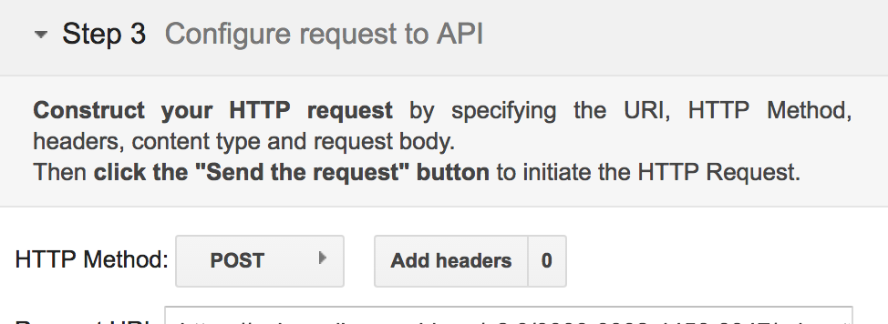
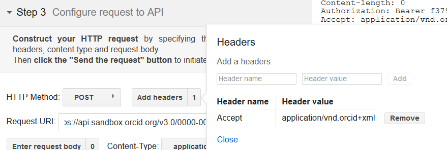
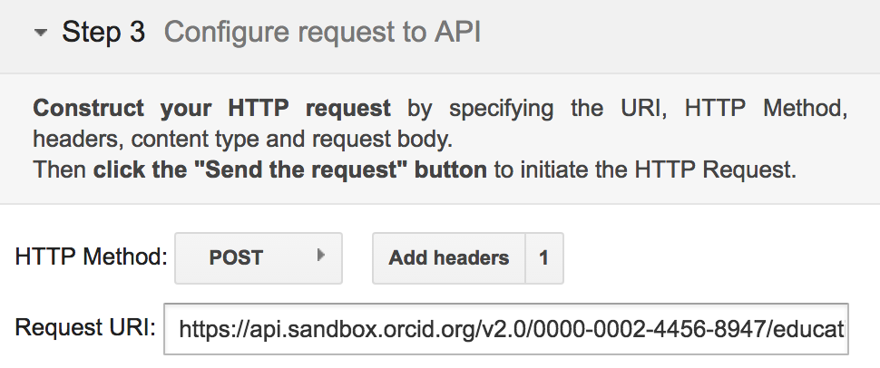
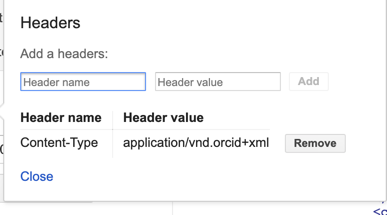
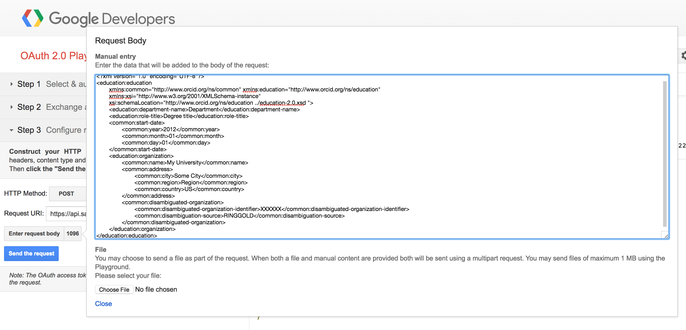
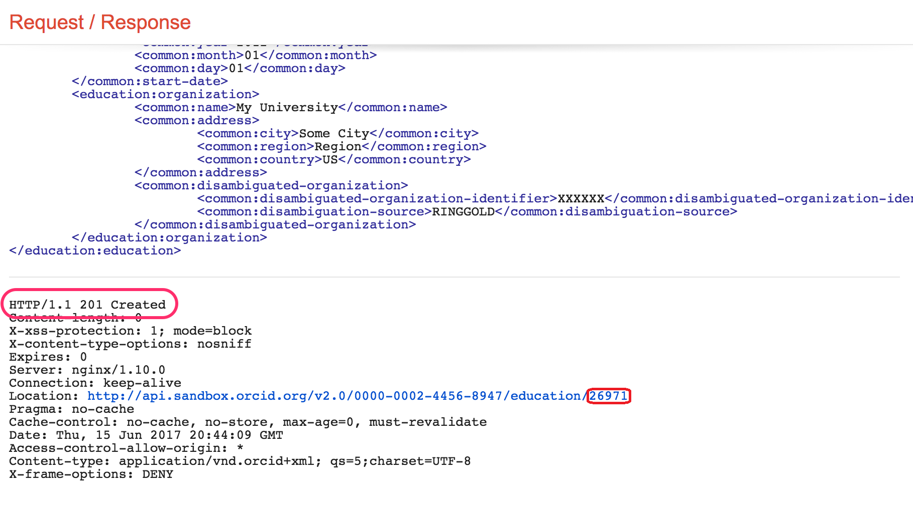
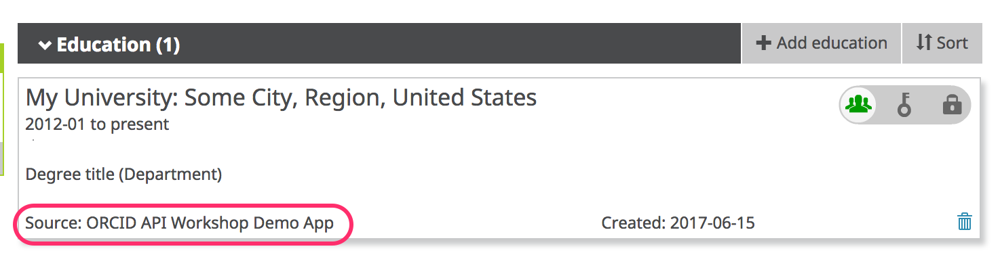

Now that we've got an Access Token, we can use it like a password to take the API actions we requested permission for (in this case, to update activities). In this section, we'll add an education affiliation to our Sandbox record.

##Add an education affiliation
Still have that Google OAuth Playground window open? If so, continue with step 1 below. If not, go back and repeat the [Get an authorization code](/collect/#get-an-authorization-code) and [Exchange authorization code for an access token](/collect/#exchange-authorization-code-for-access-token-authenticated-id) steps from the previous section before moving on to the steps below.

1. Beneath **Step 3: Configure request to API**, set **HTTP Method** to **POST**.<br>

2. Click **Add headers**, enter the values below, then click **Add** and **Close**
    - **Header name:** ```accept```
    - **Header value:** ```application/vnd.orcid+xml```
<br>

5. In the **Request URI** field enter:<br>
```https://api.sandbox.orcid.org/v2.0/[ORCID ID]/education```<br>
*Replace [ORCID ID] with the iD for your Sandbox record, format XXXX-XXXX-XXXX-XXXX*<br>

3. Click **Content-type** > **Custom** and enter ```application/vnd.orcid+xml```<br>

4. Click **Add**, then click **Close**.
6. Click **Enter request body**.
7. Copy the education affiliation XML at the end of this section and paste it into the **Request Body** text box<br>

9. **OPTIONAL:** In the **Request Body** text box, edit the XML to reflect your institution.<br>
*For ```<disambiguated-organization-identifier>```, use the [Ringgold Identify database](http://ido.ringgold.com/identify_new/cfm/si_pd.cfm?PID=1) to find the Ringgold ID for your institution (you'll need to [register a free Ringgold account](http://ido.ringgold.com/identify_new/cfm/si_pd.cfm?PID=24) in order to search the database).*
10. Click **Close**.
11. Click **Send the  request**.
12. The  results will appear in the **Request/Response** section at right. Scroll to the bottom – if you see **HTTP/1.1 201 Created**, your education affiliation was successfully added!<br>

13. Visit the public view of your Sandbox record at ```https://sandbox.orcid.org/[ORCID ID]``` to see your new education affiliation.<br>
<br>
*Notice that **Source** shows the name of the API client that added the affiliation - this is a key element that helps other systems consuming ORCID data determine whether this piece of information is authoritative.**

##Education affiliation XML

```
<?xml version="1.0" encoding="UTF-8"?>
<education:education
  xmlns:common="http://www.orcid.org/ns/common" xmlns:education="http://www.orcid.org/ns/education"
  xmlns:xsi="http://www.w3.org/2001/XMLSchema-instance"
  xsi:schemaLocation="http://www.orcid.org/ns/education ../education-2.0.xsd "> 
  <education:department-name>Department</education:department-name>
  <education:role-title>Degree title</education:role-title>
  <common:start-date>
    <common:year>2012</common:year>
    <common:month>01</common:month>
    <common:day>01</common:day>
  </common:start-date>
  <education:organization>
    <common:name>My University</common:name>
    <common:address>
      <common:city>Some City</common:city>
      <common:region>Region</common:region>
      <common:country>US</common:country>
    </common:address>
    <common:disambiguated-organization>
      <common:disambiguated-organization-identifier>XXXXXX</common:disambiguated-organization-identifier>
      <common:disambiguation-source>RINGGOLD</common:disambiguation-source>
    </common:disambiguated-organization>
  </education:organization>     
</education:education>
```