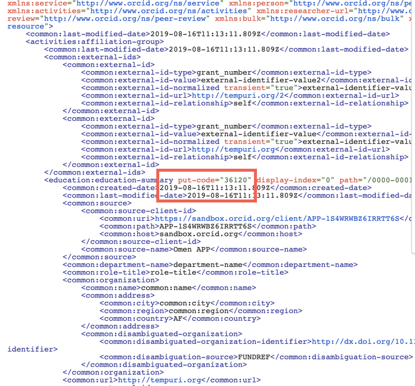
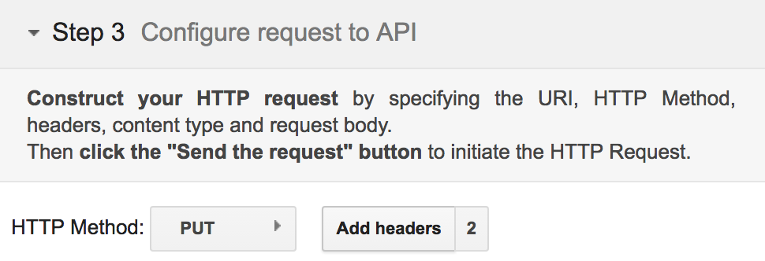
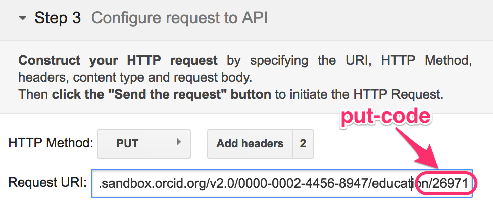
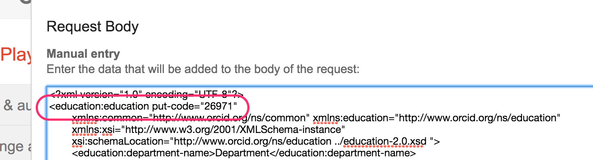
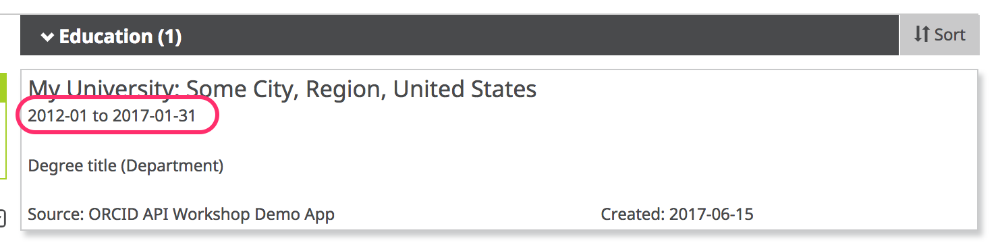

In a real-world situation, you may need to update a researcher's affiliation. In this section, we'll update our education affiliation to include an end date.

##A little about Put-codes

Put codes are short numeric codes that reference a particular item on the ORCID record. You use the put-code with the API calls to update, delete or read a particular item ( as opposed to a summary of items.)
To find out the put-code for a particular item we just need to read the record or a summary of the item we are interested in. The put-code for the item we want to modify will be returned in the response. See the XML below as an example.

In the example below we are updating a single education item. 
##Update an education affiliation

1. First we need to get a **put code** for the work you just added so open a new Google Playground window and set it up following the first 4 steps from the [Read the record](read.md) .

2. This time in the Request URI field enter ```https://api.sandbox.orcid.org/v3.0/0000-XXXX-XXXX-XXXX/educations``` . Note that we have added 'educations' to the end of the URI and that it is plural. This means we are fetching a summary of all the education items on this record, not just one (we would put it singular and added / with a put code of the item at the end)

3. Hit the 'Send the request' and you should see something like the image below in the **Request/Response** section. Find the **put-code** for the education affiliation that you added in the previous section (it will be a different number to the one highlighted here).<br>

2. Change **HTTP Method** to **PUT**<br>

3. Click **Add Headers** and make sure that ```accept``` and ```Content-type``` are both set to ```application/vnd.orcid+xml```<br>

3. In the **Request URI** field enter:<br>
```https://api.sandbox.orcid.org/v3.0/[ORCID ID]/education/[PUT CODE]```<br>
*Replace [ORCID ID] with the iD for your Sandbox record, format XXXX-XXXX-XXXX-XXXX and [PUT CODE] with the put-code for your education affiliation*<br>

2. Grab the XML from the end of the [POST](post.md) section again and the click **Enter request body** and paste it in.
3. Inside the ```<education:education``` tag, add ```put-code=[PUT CODE]```<br>
*Replace [PUT CODE] with the put-code for your education affiliation, ex ```<education:education put-code="26971"```*<br>

4. Copy the Affiliation start and end date XML at the end of this section and paste it beneath the ```</common:role-title>``` tag (and above the ```<common:organization>``` tag)<br>

5. Click **Close**.
6. Click **Send the Request**.
7. The  results will appear in the **Request/Response** section at right. Scroll to the bottom – if you see **HTTP/1.1 200 OK**, your education affiliation was successfully updated! If you see an error message, check that the header values in **Add headers** have not been changed to garbled text, ex: ```application%2Fvnd.orcid%2Bxml"```<br>

8. Visit the **public  view** of your Sandbox record at ```https://sandbox.orcid.org/[ORCID ID]``` to see your updated education affiliation.<br>
<br>

##Affiliation start and end date XML

```
<common:start-date>
        <common:year>1948</common:year>
        <common:month>02</common:month>
        <common:day>02</common:day>
</common:start-date>
<common:end-date>
        <common:year>1948</common:year>
        <common:month>02</common:month>
        <common:day>02</common:day>
</common:end-date>
```
