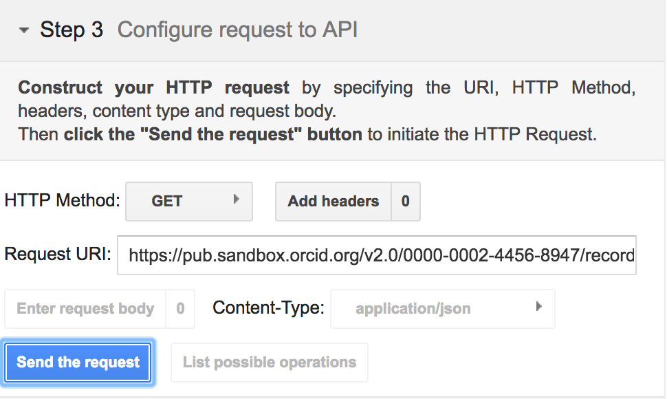
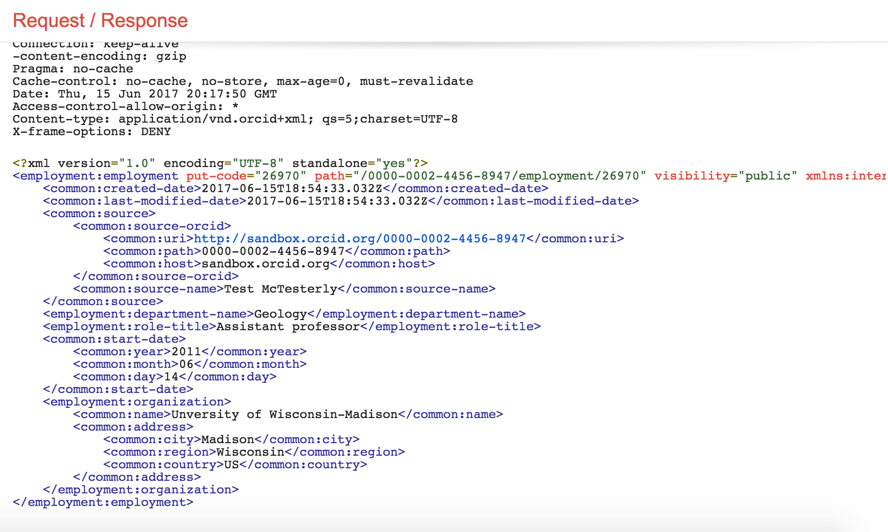

#2. READ PUBLIC INFO
In this section, we'll use the Public API to take a look at the underlying data for our Sandbox record. 

##2.1 Read a record summary
1. In a new window or tab, visit [https://developers.google.com/oauthplayground](https://developers.google.com/oauthplayground)
2. On the left side of the screen, click **Step 3 Configure request to API**
3. In the **Request URI** field enter:<br>
```https://pub.sandbox.orcid.org/v2.0/[ORCID ID]/record```<br>
*Replace [ORCID ID] with the iD for your Sandbox record, format XXXX-XXXX-XXXX-XXXX*<br>

4. Click **Send the request**
5. A summary version of your record in XML format will appear in the **Request/Response** section<br>


##2.2 Read activity details
To get more information about a specific item on an ORCID record, you can retrieve that individual item using its put-code.

1. In the record summary XML, find the **activities-summary** section, then find the **put-code** for the employment item that you added in the previous section.<br>

3. In the **Request URI** field enter:<br>
```https://pub.sandbox.orcid.org/v2.0/[ORCID ID]/employment/[PUT CODE]```<br>
*Replace [ORCID ID] with the iD for your Sandbox record, format XXXX-XXXX-XXXX-XXXX and [PUT CODE] with the put-code for your employment item*<br>

4. Click **Send the request**
5. Fulls details of your employment entry will appear in the **Request/Response** section<br>
