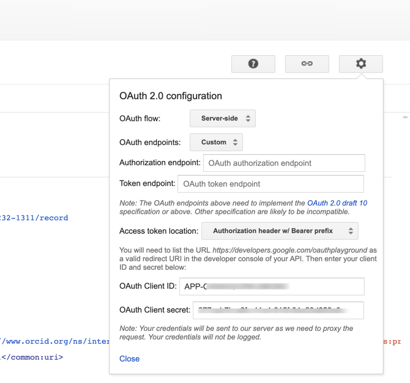
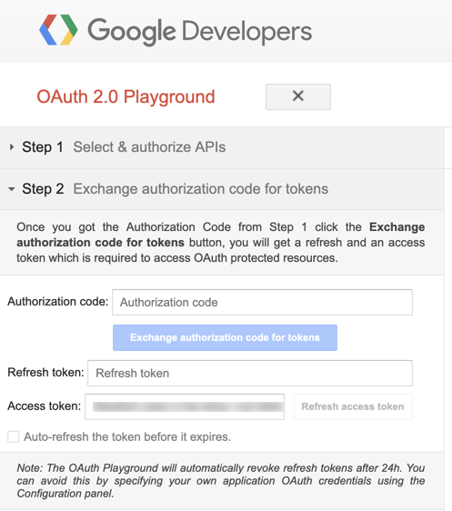
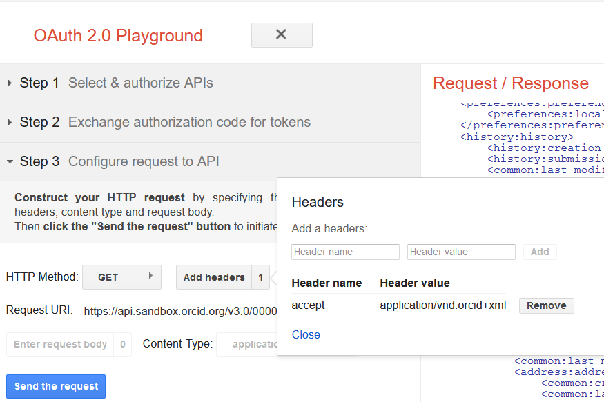
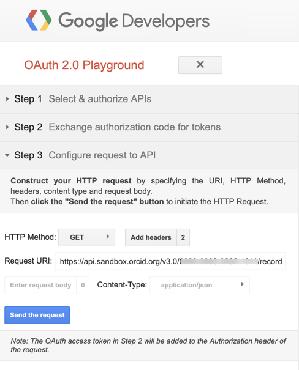
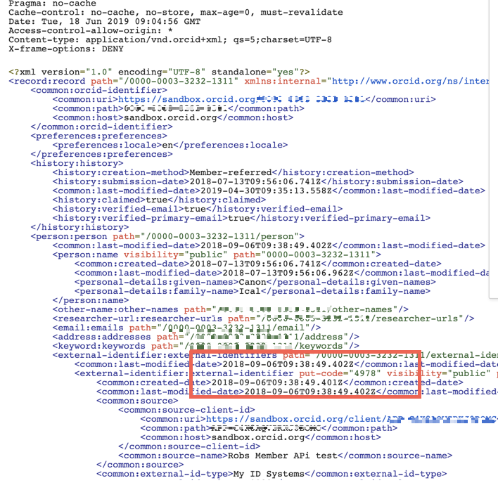

## Read the record 

**_Important! Make sure you have added something to your record before going any further. The subsequent calls won't work properly otherwise. Skip back to [Add info to your Sandbox record](/sandbox) if you are unsure about this._**

The next thing we can do with our newly acquired token is to read the record. This is the next logical step and a useful way of acquiring put-codes that you will need for PUT step later.


Revisit Google playground, hopefully you have kept the window open, if not,  you could re-initialise it with the url you saved earlier(Clicking ok on the warning that comes up). Or you can set up for the call again by filling all the relevant fields,  making sure they look like the screenshots below:

1. Make sure the **configuration** has your **client and secret**

    

2. below Step 2 you should have your **token** filled in

    It should either still have the token from earlier or you can fill it in from the previous exercise like so:

    

3. Beneath Step 3 Click **Add headers**, enter the values below, then click **Add** and **Close**
    - **Header name:** ```Content-type```
    - **Header value:** ``application/vnd.orcid+xml``
    - **Header name:** ```Authorization```
    - **Header value:** ``Your token``

    The step 3 Configurations should look like the screenshots below. You should add two headers,  
 

4. Set the HTTP Method  to **GET**. 

    


5. In the request URI field enter :

    ``https://api.sandbox.orcid.org/v3.0/0000-XXXX-XXXX-XXXX/record``

    <br>
*Replace [ORCID ID] with the iD for your Sandbox record, format XXXX-XXXX-XXXX-XXXX*<br>


    Note the _endpoint_  This is the word at the end of the URI. In this case we are reading a _summary_ of the whole record so we end the URL with /record as shown above.


    


6. Click **Send the request** 

    In the Request/Response field you should see an XML summary of the whole record. It will look a bit like the example below which shows the first part of the response. If you added something to your record as shown in [Add info to your Sandbox record](sandbox.md) you should have at least one  **put-code** returned as shown below :

    
