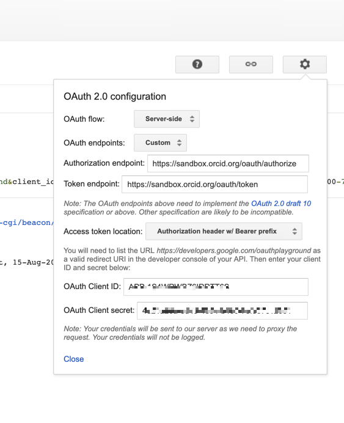

## Read the record 

**_Important! Make sure you have added something to your record before going any further. The subsequent calls won't work properly otherwise. Skip back to [Add info to your Sandbox record](/sandbox#add-info-to-your-sandbox-record) if you are unsure about this._**

The next thing we can do with our newly acquired access token is to read the record. This is the next logical step and a useful way of acquiring put-codes that you will need for the PUT step later.

Return to the browser tab for Google Playground. If you didn't keep the tab open, you can re-initialize the session with the URL you saved earlier (Clicking OK on the warning that comes up). Or you can set up for the call again by filling all the relevant fields,  making sure they look like the screenshots below:

1. Make sure the **configuration** has your **client ID and client secret**

    

2. below Step 2 you should have your **access token** filled in

    It should either still have the token from earlier or you can fill it in from the previous exercise like so:

    

3. Beneath Step 3 Click **Add headers**, enter the values below, then click **Add** and **Close**
    - **Header name:** ```Accept```
    - **Header value:** ``application/vnd.orcid+xml``

    The step 3 Configurations should look like the screenshot below:  

    

4. Set the HTTP Method  to **GET**. 

5. In the request URI field enter :

    ``https://api.sandbox.orcid.org/v3.0/0000-XXXX-XXXX-XXXX/record``

    <br>
*Replace [ORCID ID] with the iD for your Sandbox record, format XXXX-XXXX-XXXX-XXXX*<br>


    Note: the _endpoint_ is the word at the end of the URI. In this case we are reading a _summary_ of the whole record so we end the URL with ``/record`` as shown above.


    


6. Click **Send the request** 

    In the Request/Response field you should see an XML summary of the whole record. It will look a bit like the example below which shows the first part of the response. If you added something to your record as shown in [Add info to your Sandbox record](/sandbox#add-info-to-your-sandbox-record) you should have at least one  **put-code** returned as shown below :

    
