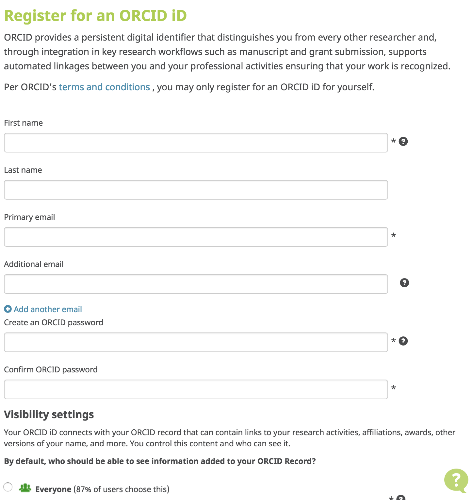

For this workshop, we'll use ORCID's test environment, the [ORCID Sandbox](https://sandbox.orcid.org/signin). The Sandbox works just like the production ORCID Registry, with a few exceptions:

* Sandbox only sends emails to [mailinator.com](https://www.mailinator.com/) addresses 
* Import wizard tools don't work in the Sandbox
* Menu links to informational content (For Researchers, For Organizations, About, Help, etc) don't work in the Sandbox
* Sandbox doesn't contain production data

##1.1 Create a Sandbox ORCID record
To get started, you'll need to register an ORCID iD in the Sandbox.

1. In a new window or tab, visit <a href="https://sandbox.orcid.org/signin" target="_blank">https://sandbox.orcid.org/register</a>
3. Complete the form with a name, email, and password. 
_**IMPORTANT!** Don&rsquo;t use a real email address! Instead, make up an address  ending in @mailinator.com (ex: sgarcia@mailinator.com)._ 

4. Click the **I consent…** checkbox and click **Register**. 
*Remember the email and password - you'll need these throughout the rest of the tutorial!*

##1.2 Verify your email address
Before you can edit information on your ORCID record, you'll need to verify your email address.

1. In a new window or tab, visit [https://www.mailinator.com](https://www.mailinator.com/)
2. Enter the @mailinator.com address you used to register your Sandbox account and click **Go**. 

3. Open the message with the subject **[ORCID] Reminder to verify your email address** and click the **Verify your email address** button. 

4. Log into ORCID, if prompted, to finish verifying your email. Since you've just registered, you are likely already logged in and will not be prompted to log in again.
5. After verifying your email, you'll be redirected to your Sandbox record 
*Make note of the 16-digit iD for your Sandbox record - you'll need this throughout the rest of the tutorial!* 

##1.3 Add info to your Sandbox record
1. **Add a country:** Click the pencil icon beside Country, choose a country and click **Save changes**. 

2. **Add employment:** In the **Employment** section, click **Add employment** > **Add manually**, fill out the form and click **Add to list**. 

3. Take a look at your employment entry and notice the following fields, which are included with each item on an ORCID record: 
    - **Source:** Person or organization that added the item
    - **Created:** Date the item was added
    - **Privacy:** [Visibility setting](https://support.orcid.org/knowledgebase/articles/124518-orcid-visibility-settings) for the item
